# Alex-OS v2.0

Framework multi-agente para Claude Code. Transforma o Claude em uma holding de agentes especializados com C-Suite executivo, Dev Domain completo, hooks de segurança e automação de sessão.

## O que e o Alex-OS?

Uma camada de configuracao sobre o Claude Code que adiciona:

- **Grand Boss** — Orquestrador que detecta dominio, roteia para o agente certo e sintetiza resultados
- **C-Suite** — CEO, CPO, CTO, COO, CFO e CMO como personas executivas especializadas
- **Dev Domain** — Strategist, Architect, Developer, Reviewer, Ops e Orchestrator
- **Hooks** — Seguranca em tempo real, auditoria automatica, digest de sessao e exportacao para Obsidian
- **Workflows** — Pipelines completos para desenvolvimento, debug, deploy e documentacao
- **Rules** — Constituicao imutavel, seguranca (ECMA-434), autoridade e economia de tokens
- **Protocolos** — Bypass direto, estimativa de custo, interacao socratica com opcoes clicaveis

---

## Instalacao

### Requisitos

- [Claude Code CLI](https://docs.anthropic.com/en/docs/claude-code) instalado
- Git Bash (Windows) ou terminal nativo (macOS/Linux)
- Python 3 no PATH (necessario para os hooks de seguranca)

### Instalar

```bash
git clone https://github.com/alexvigliazzi/alex-os.git
cd alex-os
bash install.sh
```

O installer:
1. Faz backup de arquivos existentes em `~/.claude/backups/`
2. Copia agents, commands, rules, workflows, scripts e references para `~/.claude/`
3. Gera `CLAUDE.md` a partir do template com seu usuario e home
4. Preserva `settings.json` e `mcp.json` existentes (nao sobrescreve)
5. Torna todos os scripts `.sh` executaveis
6. Valida a instalacao

### Atualizar

```bash
cd alex-os
git pull
bash install.sh
```

### Desinstalar

```bash
rm -rf ~/.claude/agents ~/.claude/commands ~/.claude/workflows \
       ~/.claude/rules ~/.claude/scripts ~/.claude/references ~/.claude/context
```

---

## Comandos disponiveis

### Grand Boss

| Comando | Funcao |
|---------|--------|
| `/boss` | Orquestrador prime — detecta dominio, roteia agentes, sintetiza |

### C-Suite (carga sob demanda)

| Comando | Funcao |
|---------|--------|
| `/ceo` | Decisoes estrategicas, visao, arbitragem cross-domain |
| `/cpo` | Produto, roadmap, UX, priorizacao de features |
| `/cto` | Arquitetura global, ADR executivo, padroes de stack |
| `/coo` | Processos, automacao, eficiencia operacional |
| `/cfo` | Financas integradas, capital, budget estrategico |
| `/cmo` | Marca, posicionamento, estrategia de crescimento |

### Dev Domain

| Comando | Funcao |
|---------|--------|
| `/strategist` | PRD, spec, requisitos, discovery — o QUE construir |
| `/architect` | Design de sistema, ADR, schema, selecao de stack — COMO construir |
| `/developer` | Implementacao orientada a story, bugfix, sprint execution |
| `/reviewer` | Code review, seguranca (OWASP/ECMA-434), WCAG 2.2, quality gate |
| `/ops` | git push, CI/CD, deploy, release — EXCLUSIVO para operacoes de producao |
| `/orchestrator` | Coordenacao multi-agente, routing de workflow, phase gate |

### Workflows

| Comando | Funcao |
|---------|--------|
| `/development` | Ciclo completo de feature (Strategist → Architect → Developer → Reviewer → Ops) |
| `/problem-resolution` | Investigacao e correcao de bug |
| `/test-deploy` | Pipeline de deploy e release |
| `/documentation` | Geracao de docs, ADR, README |
| `/context-first` | Carregamento de contexto para tarefas complexas |
| `/session-close` | Fechamento de sessao com digest manual |

---

## Hooks e Automacao

Os hooks disparam automaticamente em resposta a eventos do Claude Code. Nao requerem invocacao manual.

### Mapa de Hooks

| Evento Claude Code | Script | Funcao |
|-------------------|--------|--------|
| `UserPromptSubmit` | `scripts/language-protocol.sh` | Injeta protocolo PT-BR em cada prompt via `additionalContext` |
| `SessionStart` [1] | `scripts/hooks/pre-session.sh` | Bootstrap: verifica Ollama, carrega contexto, ativa Boss |
| `SessionStart` [2] | `echo` inline | Injeta `systemMessage`: "Protocolo PT-BR ativo" |
| `PreToolUse` | `scripts/hooks/pre-tool-use.sh` | Guard de seguranca: bloqueia comandos destrutivos, log de auditoria |
| `PostToolUse` | `scripts/hooks/post-tool-use.sh` | Audit logger: registra arquivos modificados e erros Bash |
| `Notification` | `scripts/hooks/notification.sh` | Notificacao Windows (balloon tip via PowerShell) |
| `Stop` [1] | `scripts/hooks/post-session.sh` | Auto-digest de sessao (se `/session-close` nao foi invocado) |
| `Stop` [2] | `scripts/export-session.sh` | Exporta digest para vault Obsidian via OneDrive |

### Detalhes dos Scripts

#### `language-protocol.sh` — UserPromptSubmit
Injeta instrucoes de idioma a cada prompt. Garante respostas sempre em PT-BR independente do modelo ou sessao.

#### `pre-session.sh` — SessionStart Bootstrap
```
Verificacoes ao iniciar sessao:
1. Ollama online? → gemma3:4b GRATIS (score ≤ 3) | offline → Claude API
2. Sessao anterior? → exibe ultima entrada do session-state.md
3. Projeto ativo? → exibe primeira linha do context/project.md
4. CIAM disponivel? → busca semantica ativa/inativa
```

#### `pre-tool-use.sh` — Security Guard (PreToolUse)
Bloqueia **antes** da execucao. Registra todas as tool calls em `context/tool-audit.log`.

Comandos Bash bloqueados (lista negra):
```
git push --force / -f / --force-with-lease
git reset --hard
git checkout -- .
git clean -f
git branch -d main|master
rm -rf / | rm -rf ~
DROP TABLE | DROP DATABASE
dd if= | mkfs | format c:
```

Tambem implementa **SDD Phase Guard**: bloqueia Write/Edit em codigo de producao quando `SDD_PHASE` esta definida (permite escrita apenas em `.claude/plans/`, `.claude/memory/`, `.claude/context/`).

#### `post-tool-use.sh` — Audit Logger (PostToolUse)
- Registra arquivo modificado em `tool-audit.log` para cada `Write`/`Edit`
- Registra erros Bash em `memory/napkin.md` para debugging posterior

#### `post-session.sh` — Auto-Digest (Stop fase 1)
Gera digest automatico ao encerrar sessao se `/session-close` nao foi invocado. Extrai do `tool-audit.log`:
- Arquivos modificados no dia
- Erros Bash registrados
- Comandos bloqueados
- Conteudo do `session-state.md`

Salva em `memory/sessions/YYYY-MM-DD_HHMM_auto.md`.

#### `export-session.sh` — Obsidian Export (Stop fase 2)
Exporta o digest mais recente para o vault Obsidian em `OneDrive/alex-master-brain/02_Relatorios_e_Sessoes/Dev/`. Usa ordenacao lexicografica (confiavel no OneDrive).

### Scripts Utilitarios

Chamados manualmente ou por outros scripts:

| Script | Funcao |
|--------|--------|
| `utils/ollama-router.sh` | Interface completa com Ollama: `check`, `query`, `summarize`, `embed`, `chat` |
| `utils/status-line.sh` | Status bar do Claude Code: dominio atual, modelo, Ollama status, SDD phase |
| `utils/file-suggestion.sh` | FileSuggestion: sugere arquivos relevantes por projeto (GAS/Next.js/global) |
| `utils/api-key-helper.sh` | Resolve API key Anthropic: `.credentials.json` → env var → `.env` |
| `utils/ciam-query.sh` | Wrapper CLI para CIAM HTTP API (busca semantica local) |
| `scripts/hooks/ollama-check.sh` | Verifica Ollama e retorna modelo recomendado com custo |

#### `ollama-router.sh` — Uso

```bash
# Verificar se Ollama esta online
bash ollama-router.sh check

# Enviar prompt (score ≤ 3 = GRATIS)
bash ollama-router.sh query "Resuma este texto"

# Sumarizacao
bash ollama-router.sh summarize "$(cat arquivo.md)"

# Embedding semantico
bash ollama-router.sh embed "busca semantica"

# Chat com contexto de sistema
bash ollama-router.sh chat "O que e Kubernetes?" "Responda como senior DevOps"

# Listar modelos instalados
bash ollama-router.sh models
```

---

## Protocolos de Comportamento

### Protocolo de Inicio de Operacao

Toda operacao nao-conversacional apresenta:

```
## Avaliacao de Operacao
**Prompt:** [resumo]
**Score:** [1-10] | **Modelo:** [haiku|sonnet|opus] | **Otimizacao:** [necessaria|nao]

| Etapa | Modelo | Input est. | Output est. | Custo est. |
|-------|--------|-----------|------------|-----------|
| nome  | sonnet | ~20k tok   | ~5k tok     | ~$0,09    |
| Total |        | ~20k tok   | ~5k tok     | ~$0,09    |
```

E ao final:
```
## Consumo da Operacao
| Etapa | Modelo | Custo estimado |
| Total |        | ~$0,09         |
```

### Selecao de Modelo

```
Ollama online + score ≤ 3  →  gemma3:4b  (GRATIS)
Ollama offline + score ≤ 3 →  haiku      (1x)
Score 4-8                  →  sonnet     (10x) [padrao]
Score 9-10                 →  opus       (30x) [arch, cross-module]
```

### Modo BYPASS (padrao)

O modo padrao e `bypassPermissions`. Em BYPASS:
- **PROIBIDO** perguntar "Posso prosseguir?" antes de agir
- **PROIBIDO** pausar esperando confirmacao textual
- **OBRIGATORIO** confirmar apenas: git push para main, operacoes destrutivas irreversiveis, deploy para producao

Aplica-se a todos os modelos (haiku, sonnet, opus).

### Interacao Socratica

Coleta de opcoes usa `AskUserQuestion` — apresenta escolhas clicaveis no input do Claude Code. Nao usa texto livre [A][B][C].

---

## Estrutura do Repositorio

```
alex-os/
├── agents/
│   ├── _boss.md              # Grand Boss — persona padrao
│   ├── _registry.md          # Roteamento global de agentes
│   ├── csuite/               # C-Suite (ceo, cpo, cto, coo, cfo, cmo)
│   │   └── _registry.md      # Sub-registry C-Suite
│   └── dev/                  # Dev Domain (strategist, architect, developer, reviewer, ops, orchestrator)
├── commands/                 # Slash commands (/boss, /ceo ... /orchestrator, workflows)
├── context/                  # project.md + session-state.md
├── docs/
│   └── specs/                # Specs tecnicas (ollama-integration-vision.md)
├── rules/
│   ├── constitution.md       # 6 artigos imutaveis
│   ├── authority.md          # Matriz de autoridade por papel
│   ├── security.md           # Guardrails + ECMA-434 AI Agent Security
│   ├── token-economy.md      # Budget, compressao, cache, model routing
│   ├── language.md           # Protocolo PT-BR obrigatorio
│   └── context7.md           # MCP Context7 para docs de bibliotecas
├── scripts/
│   ├── language-protocol.sh  # Hook UserPromptSubmit — protocolo de idioma
│   ├── export-session.sh     # Hook Stop — exporta digest para Obsidian
│   ├── hooks/
│   │   ├── pre-session.sh    # Hook SessionStart — bootstrap
│   │   ├── pre-tool-use.sh   # Hook PreToolUse — security guard + audit
│   │   ├── post-tool-use.sh  # Hook PostToolUse — audit logger
│   │   ├── post-session.sh   # Hook Stop — auto-digest
│   │   ├── notification.sh   # Hook Notification — balloon Windows
│   │   └── ollama-check.sh   # Utilitario: verifica Ollama + recomenda modelo
│   └── utils/
│       ├── ollama-router.sh  # Interface Ollama (query/summarize/embed/chat)
│       ├── status-line.sh    # Status bar Claude Code
│       ├── file-suggestion.sh # FileSuggestion por projeto
│       ├── api-key-helper.sh # Resolve Anthropic API key
│       └── ciam-query.sh     # CIAM HTTP query wrapper
├── references/               # Documentacao de ferramentas externas
├── workflows/                # Pipelines (development, problem-resolution, etc.)
├── templates/
│   ├── CLAUDE.md.template    # Template do CLAUDE.md (placeholders {{USERNAME}})
│   ├── settings.json.template # Template de settings com hooks configurados
│   └── mcp.json.template     # Template MCP (ciam, context7)
└── install.sh                # Installer: repo → ~/.claude/
```

---

## Ferramentas Externas Integradas

| Ferramenta | Status | Funcao |
|-----------|--------|--------|
| **ciam** | Ativo (MCP + Docker) | Busca semantica, memoria persistente, ADRs, PRDs |
| **Ollama** | Ativo (Docker) | gemma3:4b GRATIS para score ≤ 3 + embeddings |
| **seshat** | Ativo (Docker) | Busca semantica local com nomic-embed-text |
| **ralph** | Ativo (plugin) | Implementacao iterativa com completion-promise |
| **squidy** | Parcial | Scaffolding de projeto (bug UnicodeEncodeError no Windows) |

---

## Compatibilidade

| Plataforma | Suporte |
|-----------|---------|
| Claude Code CLI | Completo |
| VS Code (extensao Claude Code) | Completo |
| Antigravity (desktop app) | Completo |
| claude.ai/code (web) | Completo |
| Windsurf | Nao (usa `.codeium/windsurf/`) |

---

## Diagramas de Pipeline

### Arquitetura do Sistema

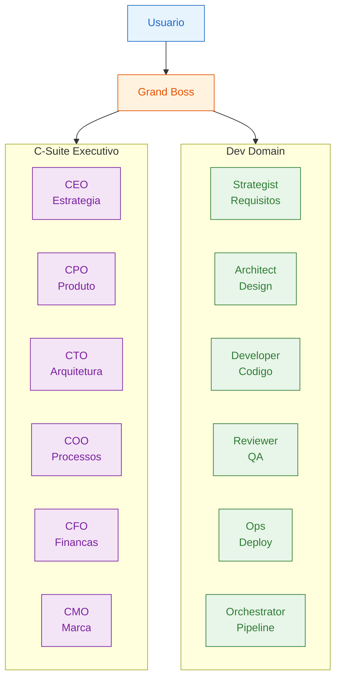

### Roteamento de Requests

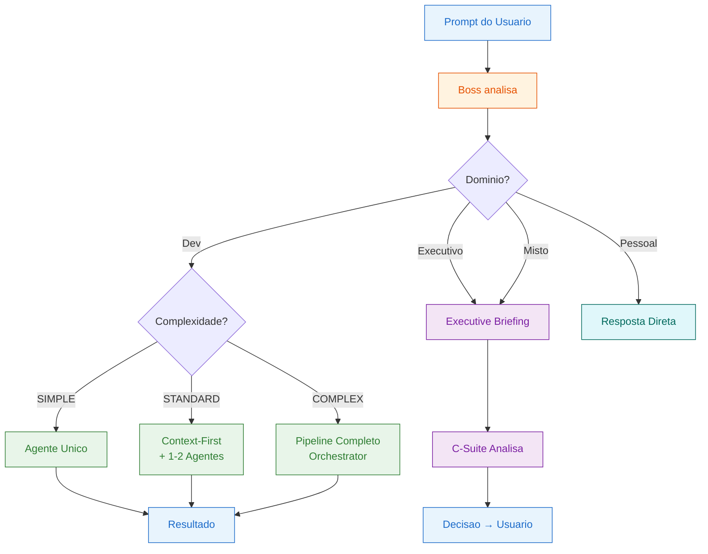

### Pipeline de Desenvolvimento

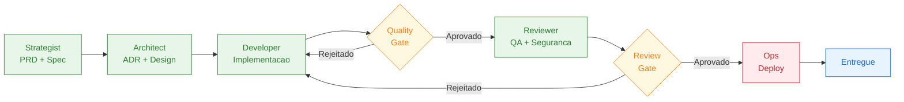

### Pipeline Executive Briefing

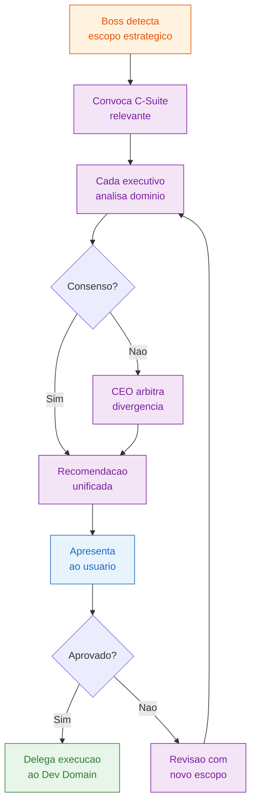

### Workflows Especializados

#### Problem Resolution

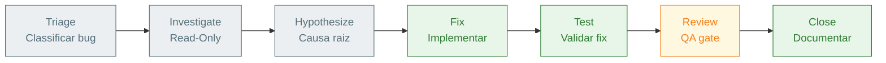

#### Test and Deploy

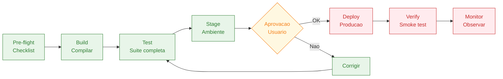

#### SDD-TDD (Metodo Akita)

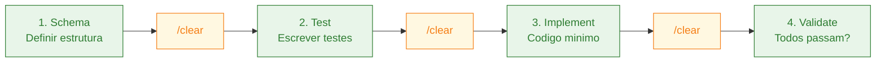

### Cenarios de Exemplo

#### Tarefa Pessoal

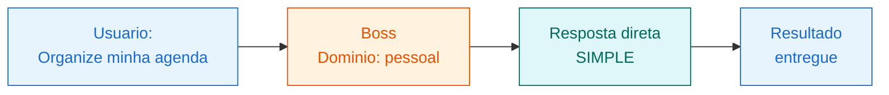

#### Ideacao

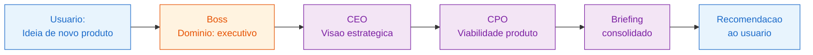

#### Desenvolvimento de Software

```mermaid
flowchart LR
    U["Usuario:\nNova feature X"]:::user --> B["Boss\nDominio: dev"]:::boss
    B --> O["Orchestrator\nCOMPLEX"]:::dev
    O --> S["Strategist\nSpec"]:::dev
    S --> A["Architect\nDesign"]:::dev
    A --> D["Developer\nCodigo"]:::dev
    D --> Rev["Reviewer\nQA"]:::dev
    Rev --> Ops["Ops\nDeploy"]:::prod
    Ops --> R["Feature\nentregue"]:::user

    classDef user fill:#E8F4FD,stroke:#1B6AC9,color:#1B6AC9
    classDef boss fill:#FFF3E0,stroke:#E65100,color:#E65100
    classDef dev fill:#E8F5E9,stroke:#2E7D32,color:#2E7D32
    classDef prod fill:#FFEBEE,stroke:#C62828,color:#C62828
```

#### Correcao de Bug

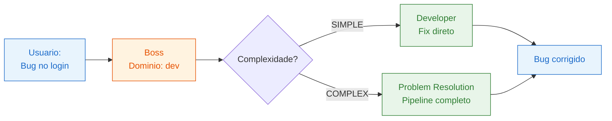

#### Debug

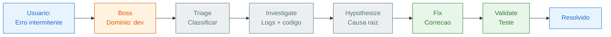

#### Refatoracao

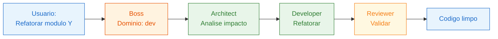

#### Posts Instagram

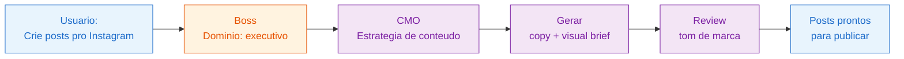

#### Tarefas Rotineiras

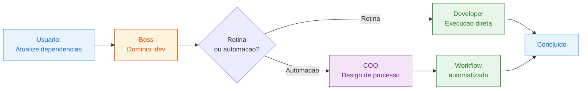

---

## Licenca

Uso pessoal. Feito por Alex Vigliazzi.
